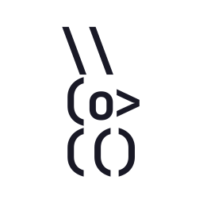

<p align="center">
  <a href="" rel="noopener">
 </a>
</p>

<h1 align="center">CodeNest</h1>

<div align="center">

[]()
[](https://github.com/Jeshwin/codenest)
[](https://github.com/Jeshwin/codenest)
[](https://github.com/Jeshwin/codenest/issues)
[](/LICENSE)

</div>

---

<p align="center">
  CodeNest is a fully-featured, web-based code editor
  <br> 
</p>

## 📝 Table of Contents

-   [About](#about)
-   [Getting Started](#getting_started)
-   [Installing](#installing)
-   [Testing](#tests)
-   [Usage](#usage)
-   [Deployment](#deployment)
-   [Built Using](#built_using)
-   [Authors](#authors)
-   [Acknowledgments](#acknowledgement)

## 🧐 About <a name = "about"></a>

CodeNest is a fully-featured, web-based code editor that allows anyone to implement their ideas without any need to install new software. Through our platform, you can access any development environment, create a new project in any programming language, and run it hassle-free on the cloud, all without leaving your browser window.

We initially started CodeNest to gain experience working on a large project as a group. Eventually, CodeNest became a proof-of-concept, an idea that we could keep building into a reality. Our goal is that CodeNest becomes a gateway to new programmers, making coding more accessible to the world.

## 🏁 Getting Started <a name = "getting_started"></a>

These instructions will get you a copy of the project up and running on your local machine for development and testing purposes.

### Installing <a name = "installing"></a>

Clone the repository

```
git clone https://https://github.com/Jeshwin/codenest.git
```

Change to the `codenest` directory

```
cd codenest
```

Download the node dependencies

```
npm install
```

Run the development build

```
npm run dev
```

The instance will be available on `localhost:3000`

## 🔧 Testing <a name = "tests"></a>

Run the tests using [Jest](https://jestjs.io/)

```
npm test
```

## 🎈 Usage <a name="usage"></a>

See our [wiki page](https://github.com/Jeshwin/codenest/wiki) on how to use CodeNest

## 🚀 Deployment <a name = "deployment"></a>

CodeNest is deployed using [AWS](https://aws.amazon.com/) and is publicly available [here](https://codenest.space/)!

## ⛏️ Built Using <a name = "built_using"></a>

-   [Next.js](https://nextjs.org/) - Web Framework
-   [React](https://react.dev/) - Component Library
-   [TailwindCSS](https://tailwindcss.com/) - CSS Framework
-   [AWS](https://aws.amazon.com/) - Web Hosting and Compute

## ✍️ Authors <a name = "authors"></a>

-   [@Jeshwin](https://github.com/Jeshwin)
-   [@ethank2222](https://github.com/ethank2222)
-   [@Arnie](https://github.com/)

See also the list of [contributors](https://github.com/Jeshwin/codenest/contributors) who participated in this project.

## 🎉 Acknowledgements <a name = "acknowledgement"></a>

-   Hat tip to anyone whose code was used
-   Inspiration
    -   [Replit](https://repl.it)
    -   [StackBlitz](https://stackblitz.com/)
    -   [Lapce](https://lapce.dev/)
-   References
